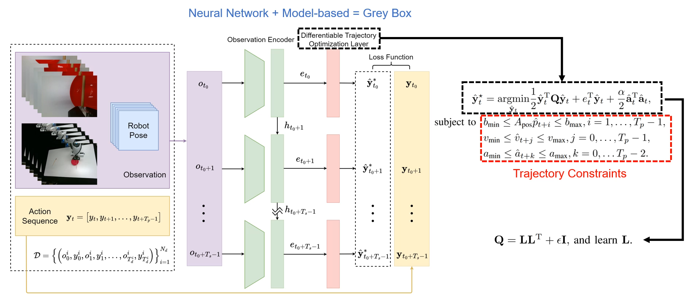

# LeTO: Learning Constrained Visuomotor Policy with Differentiable Trajectory Optimization 
### Zhengtong Xu, [Yu She](https://www.purduemars.com/home)

_Purdue University_

[Summary Video](https://drive.google.com/file/d/1-Ty2JRg8COrHM_cl0vaj-xSGzjnZOg7L/view?usp=sharing)

---
LeTO uniquely integrates a differentiable trajectory optimization layer for visuomotor policy learning, enabling generating actions in a safe and controlled fashion.



---

## Codebase

The code is adapted from [diffusion policy](https://github.com/real-stanford/diffusion_policy) and [robomimic](https://github.com/ARISE-Initiative/robomimic).

For details of LeTO and the differentiable trajectory optimization, please see [LeTO/model/LeTO.py](LeTO/model/LeTO.py).

---

## Installation

We use the same installation process as diffusion policy. Please refer to [this instruction](https://github.com/real-stanford/diffusion_policy/blob/main/README.md) for a detailed installation guide and use [this yaml file](conda_environment.yaml). In addition, please also install diffusion policy in `letoenv`.

For downloading the simulation training datasets, please refer to [this instruction](https://github.com/real-stanford/diffusion_policy/blob/main/README.md).

## Start Training

Activate conda environment and login to [wandb](https://wandb.ai) (if you haven't already).
```console
$ conda activate letoenv
$ wandb login
```

For example, launch training with seed 42 on GPU 0.
```console
$ python train_LeTO.py --config-dir=./LeTO/config --config-name=train_LeTO_robomimic_square_mh.yaml training.seed=42 training.device=cuda:0 hydra.run.dir='data/outputs/${now:%Y.%m.%d}/${now:%H.%M.%S}_${name}_${task_name}'
```
## Checkpoints
Checkpoints and training logs of LeTO can be accessed via [this Google drive link](https://drive.google.com/drive/folders/1k9mgGRDWoOkPDWeXKYJW23SVDM11F7Nf?usp=sharing).
